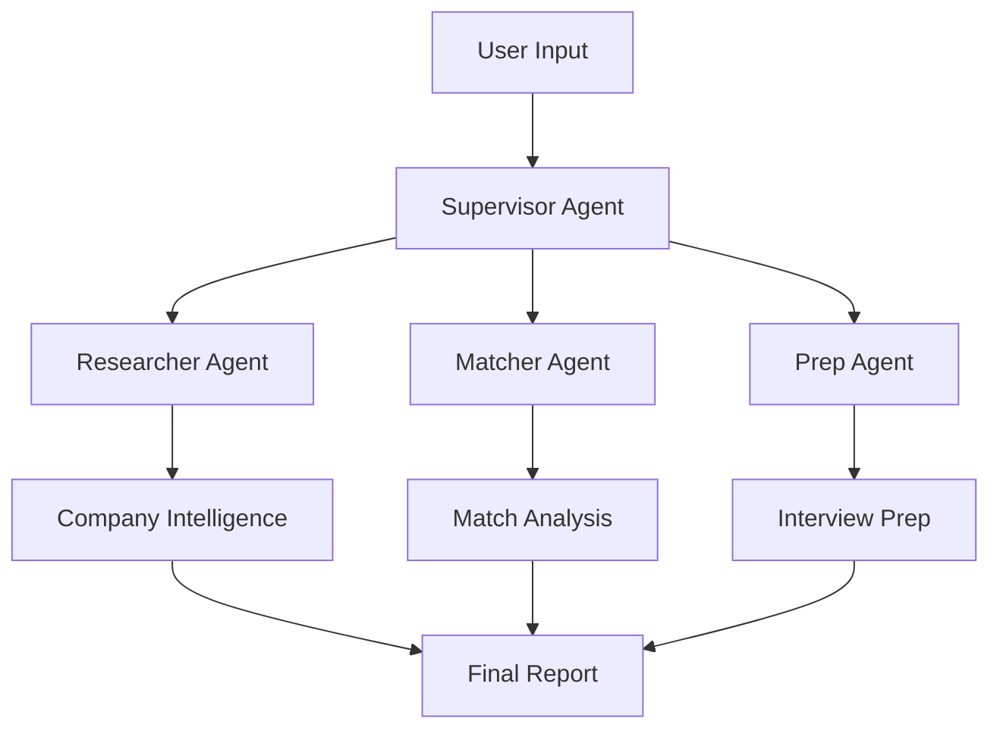
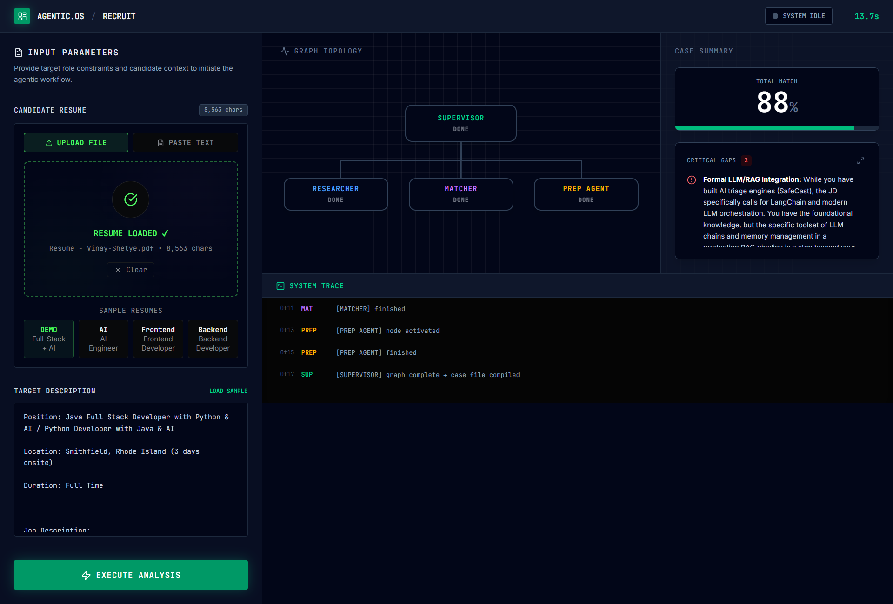
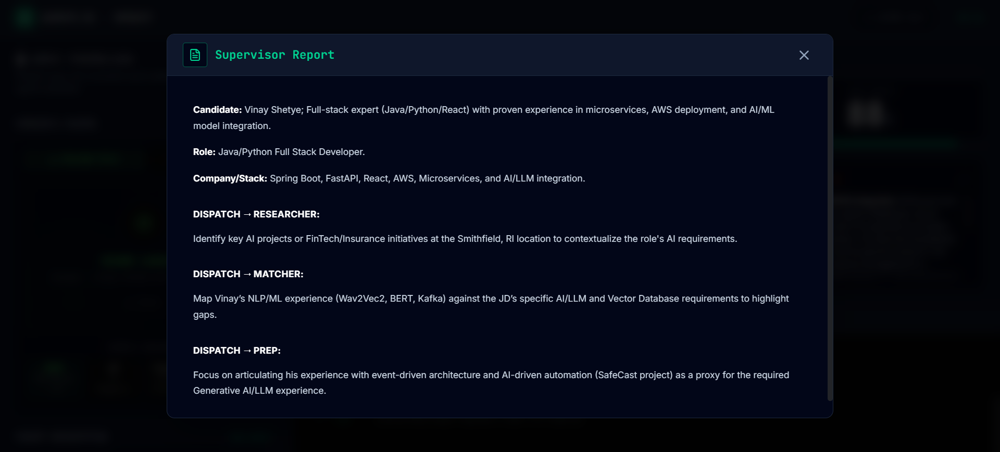
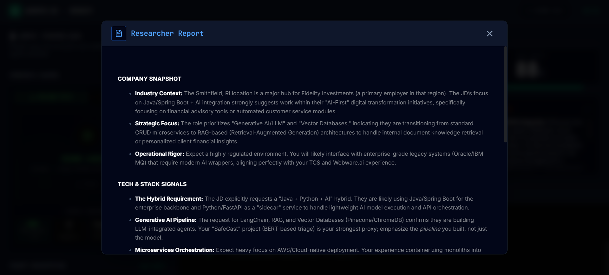
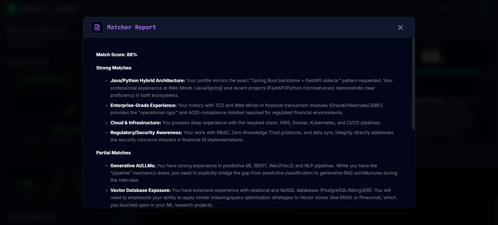
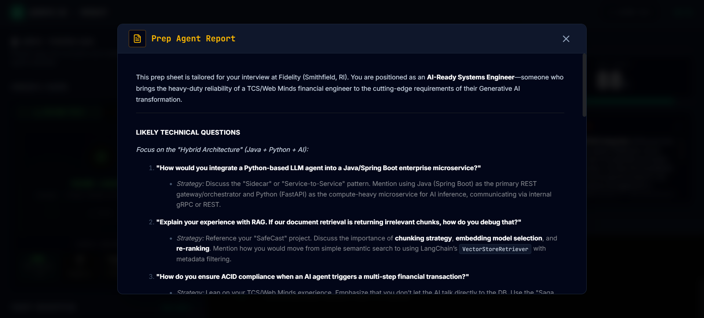
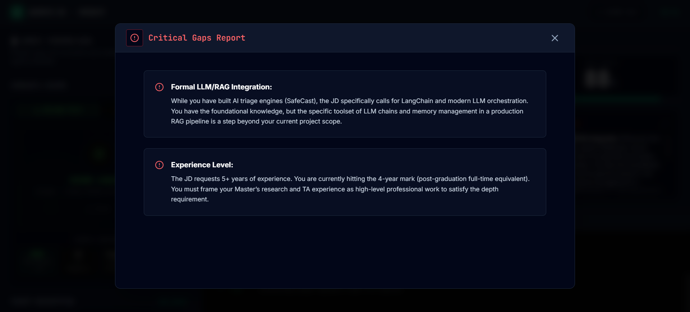

<div align="center">

# 🤖 AI-Powered Job Assistant

**Multi-agent system for intelligent job application analysis powered by LangGraph and real-time AI streaming**


<br/>

[](https://react.dev/)
[](https://www.typescriptlang.org/)
[](https://tanstack.com/start)
[](https://github.com/langchain-ai/langgraph)
[](https://tailwindcss.com/)
[](https://vitejs.dev/)
[](LICENSE)

[🚀 Live Demo](https://multi-agent-job-assistant.netlify.app/)

</div>

---

## 📋 Project Overview

**AGENTIC.OS // RECRUIT** is a production-ready, full-stack AI application that revolutionizes job application analysis through a sophisticated multi-agent architecture. Upload your resume and paste a job description watch as autonomous AI agents collaborate in real-time to analyze fit, research companies, identify skill gaps, and generate personalized interview preparation.

### 🎯 What Makes This Special

- **🧠 Multi-Agent Architecture**: Supervisor-coordinated agent graph using LangGraph patterns
- **⚡ Real-Time Streaming**: Server-Sent Events (SSE) for live AI response streaming
- **🎨 Terminal-Inspired UI**: Professional dark theme with neon accents and animations
- **📄 Smart Resume Parsing**: Supports PDF, DOCX, and TXT with advanced extraction
- **🔄 Intelligent Orchestration**: Dynamic task routing and state management
- **📊 Visual Analytics**: Match scoring, gap analysis, and graph topology visualization

---

## 🏗️ Architecture (High-Level Design)

<div align="center">

</div>

### Agent System Design



#### 🎭 Agent Roles

| Agent          | Responsibility                | Tools                             | Output                              |
| -------------- | ----------------------------- | --------------------------------- | ----------------------------------- |
| **Supervisor** | Task routing & orchestration  | State management, flow control    | Execution plan                      |
| **Researcher** | Company & market intelligence | Web search (Tavily API), scraping | Company insights, market context    |
| **Matcher**    | Resume-JD gap analysis        | Resume parser, skill extraction   | Match score (0-100%), gap list      |
| **Prep Agent** | Interview preparation         | Question generation, frameworks   | Tailored questions, prep strategies |

---

## 📸 Screenshots

### Full Application Walkthrough

| Screenshot                                                                   | Description                                                                                                                            |
| ---------------------------------------------------------------------------- | -------------------------------------------------------------------------------------------------------------------------------------- |
|     | **Resume Upload & Input** - Drag-and-drop resume upload with support for PDF, DOCX, and TXT formats. Job description paste area below. |
|  | **Real-Time Analysis** - Watch agents execute in real-time with live execution trace showing all agent activities.                     |
|       | **Match Score Display** - Prominent match percentage with visual progress bar and assessment indicators.                               |
|    | **Agent Graph Visualization** - Visual representation of the supervisor and worker agents executing tasks.                             |
|          | **Skill Gap Analysis** - Identified gaps between resume and job requirements with detailed explanations.                               |
|     | **Tabbed Agent Reports** - Detailed outputs from Researcher, Matcher, and Prep agents in organized tabs.                               |

---

## ✨ Features

### 🎨 Modern User Interface

<div align="center">

</div>

- **Split-Panel Layout**: Efficient input/results organization
- **2×2 Results Grid**: Match score, graph topology, gaps, and prep question
- **Real-Time Execution Trace**: Live agent activity monitoring with colored logs
- **Tabbed Agent Reports**: Detailed outputs from each agent in organized tabs
- **Responsive Design**: Optimized for desktop and tablet viewing
- **Accessibility**: WCAG-compliant components from Radix UI

### 🚀 Technical Highlights

**Frontend Stack:**

- **React 19.2** with latest features and concurrent rendering
- **TypeScript 5.8** for type-safe development
- **TanStack Router** for file-based routing with SSR support
- **TanStack Start** for modern full-stack React framework
- **Tailwind CSS 4.2** with custom terminal-inspired design system
- **Framer Motion** for smooth animations and transitions
- **Radix UI** for accessible, unstyled component primitives

**Backend Architecture:**

- **Nitro** server with Cloudflare edge deployment
- **Server-Sent Events** for real-time AI streaming
- **LangGraph** multi-agent orchestration patterns
- **Multiple AI Providers**: OpenAI, Gemini, OpenRouter support
- **Intelligent Fallbacks**: Automatic provider switching on failures

**File Processing:**

- **PDF Parsing**: pdf.js-dist 6.1 with advanced text extraction
- **DOCX Support**: Mammoth.js for Word document parsing
- **Text Input**: Direct paste support with validation

---

## 🚀 Quick Start

### Prerequisites

- **Node.js** 18+ (20+ recommended)
- **npm** or **yarn**
- **AI Provider API Keys** (OpenAI, Gemini, or OpenRouter)

### Installation

```bash
# Clone the repository
git clone https://github.com/VinayShetyeOfficial/multi-agent-job-assistant.git
cd multi-agent-job-assistant

# Install dependencies
npm install

# Configure environment variables
cp .env.example .env
# Edit .env with your API keys
```

### Configuration

Create a `.env` file in the root directory:

```env
# Required: At least one AI provider
OPENAI_API_KEY=your_openai_api_key_here
# OR
GEMINI_API_KEY=your_gemini_api_key_here
# OR
OPENROUTER_API_KEY=your_openrouter_api_key_here

# Optional: Web search capabilities
TAVILY_API_KEY=your_tavily_api_key_here

# Server configuration
PORT=8080
NODE_ENV=development
```

### Run Development Server

```bash
# Start the dev server
npm run dev

# Server will start at http://localhost:8080
```

### Build for Production

```bash
# Create optimized production build
npm run build

# Preview production build locally
npm run preview

# Deploy to Cloudflare (requires Wrangler setup)
npm run deploy
```

---

## 📖 Usage Guide

### Basic Workflow

1. **Upload Resume**
   - Drag & drop PDF/DOCX/TXT file
   - Or paste resume text directly
   - Or use sample resumes for testing

2. **Paste Job Description**
   - Copy job posting from any source
   - Use "LOAD SAMPLE" for demo JD
   - Minimum 20 characters required

3. **Start Analysis**
   - Click "START ANALYSIS" button
   - Watch agents execute in real-time
   - View live execution trace

4. **Review Results**
   - **Match Score**: Percentage fit between resume and JD
   - **Graph Topology**: Visual agent execution flow
   - **Key Gaps**: Identified skill/experience gaps
   - **Prep Question**: AI-generated interview question

5. **Explore Agent Reports**
   - Switch between tabs: **RES** / **MAT** / **PREP**
   - View detailed research, analysis, and strategies
   - Copy insights for interview preparation

### Sample Resumes Included

- **DEMO**: Full-Stack + AI Engineer (comprehensive example)
- **AI Engineer**: ML/AI specialist profile
- **Frontend Developer**: React/TypeScript focused
- **Backend Developer**: Systems/Cloud architect

---

## 🎯 Use Cases

### For Job Seekers

- **Quick Application Assessment**: Understand job fit before applying
- **Gap Identification**: Know exactly what skills to highlight or develop
- **Interview Preparation**: Get AI-generated prep questions and strategies
- **Company Research**: Automated intelligence gathering

### For Recruiters

- **Candidate Screening**: Rapid resume-JD matching at scale
- **Gap Analysis**: Identify training needs for internal candidates
- **Interview Prep**: Generate role-specific questions
- **Market Intelligence**: Research company positioning and competitors

### For Developers

- **LangGraph Learning**: Production-ready multi-agent implementation
- **Streaming AI**: Real-time SSE with token-by-token updates
- **Full-Stack React**: Modern TanStack Start patterns
- **UI/UX**: Terminal-inspired design system reference

---

## 🛠️ Technology Deep Dive

### Multi-Agent System (LangGraph)

```typescript
// Simplified supervisor pattern
const supervisorGraph = new StateGraph({
  channels: {
    resume: { value: (x, y) => y },
    jobDescription: { value: (x, y) => y },
    agentOutputs: { value: (x, y) => ({ ...x, ...y }) },
  },
});

// Agent nodes
supervisorGraph.addNode("researcher", researcherAgent);
supervisorGraph.addNode("matcher", matcherAgent);
supervisorGraph.addNode("prep", prepAgent);

// Conditional routing
supervisorGraph.addConditionalEdges("supervisor", (state) => routeToNextAgent(state), {
  researcher: "researcher",
  matcher: "matcher",
  prep: "prep",
  end: END,
});
```

### Real-Time Streaming Architecture

```typescript
// Server-Sent Events implementation
export async function POST({ request }) {
  const { jd, resume } = await request.json();

  const stream = new ReadableStream({
    async start(controller) {
      for await (const event of runAgentGraph(jd, resume)) {
        // Send events: agent_start, token, agent_done, done
        controller.enqueue(`data: ${JSON.stringify(event)}\n\n`);
      }
      controller.close();
    },
  });

  return new Response(stream, {
    headers: {
      "Content-Type": "text/event-stream",
      "Cache-Control": "no-cache",
      Connection: "keep-alive",
    },
  });
}
```

### State Management

- **React 19 Hooks**: `useState`, `useCallback`, `useMemo`, `useRef`
- **TanStack Router**: File-based routing with type-safe navigation
- **Server State**: SSE connection management and reconnection logic
- **UI State**: Collapsible sections, active tabs, animation triggers

---

## 📁 Project Structure

```
multi-agent-job-assistant/
├── src/
│   ├── routes/
│   │   ├── index.tsx              # Main dashboard UI
│   │   └── api/
│   │       └── analyze.ts         # Agent orchestration API
│   ├── components/
│   │   ├── ui/                    # Radix UI components
│   │   └── ResumeUpload.tsx       # File upload & parsing
│   ├── styles.css                 # Global Tailwind styles
│   ├── router.tsx                 # TanStack Router config
│   └── server.ts                  # Nitro server entry
├── assets/                        # README images
│   ├── hero-banner.png
│   ├── architecture-diagram.png
│   └── ui-showcase.png
├── public/                        # Static assets
├── .env.example                   # Environment template
├── vite.config.ts                # Vite configuration
├── tailwind.config.ts            # Tailwind theming
├── tsconfig.json                 # TypeScript config
└── package.json                  # Dependencies
```

---

## 🎨 Design System

### Color Palette

```css
/* Terminal Theme */
--background: 222.2 84% 4.9%; /* Slate 950 */
--foreground: 210 40% 98%; /* Slate 50 */
--accent: 142.1 76.2% 36.3%; /* Emerald 600 */
--destructive: 0 62.8% 30.6%; /* Red 700 */
--border: 217.2 32.6% 17.5%; /* Slate 800 */
--muted: 217.2 32.6% 17.5%; /* Slate 800 */
```

### Typography

- **Headings**: Inter (sans-serif), bold weights
- **Body**: Inter (sans-serif), regular/medium weights
- **Code/Mono**: JetBrains Mono, IBM Plex Mono fallback
- **Sizes**: Fluid scale from 10px (labels) to 96px (hero scores)

---

## 🧪 Testing & Quality

### Included Validations

- **TypeScript** strict mode enabled
- **ESLint** with React/TypeScript rules
- **Prettier** for code formatting
- **Type-safe** API contracts with Zod schemas

### Manual Testing Checklist

- [ ] Resume upload (PDF, DOCX, TXT)
- [ ] Job description validation
- [ ] Real-time streaming
- [ ] Agent execution flow
- [ ] Match score calculation
- [ ] Tab navigation
- [ ] Responsive layout
- [ ] Error handling & recovery

---

## 🚀 Deployment

### Cloudflare Pages (Recommended)

```bash
# Install Wrangler CLI
npm install -g wrangler

# Login to Cloudflare
wrangler login

# Deploy
npm run build
wrangler pages deploy dist
```

### Vercel

```bash
# Install Vercel CLI
npm install -g vercel

# Deploy
npm run build
vercel --prod
```

### Docker

```dockerfile
FROM node:20-alpine
WORKDIR /app
COPY package*.json ./
RUN npm ci --production
COPY . .
RUN npm run build
EXPOSE 8080
CMD ["npm", "run", "preview"]
```

---

## 🤝 Contributing

Contributions are welcome! Follow these steps:

1. **Fork** the repository
2. **Create** a feature branch (`git checkout -b feature/amazing-feature`)
3. **Commit** changes (`git commit -m 'Add amazing feature'`)
4. **Push** to branch (`git push origin feature/amazing-feature`)
5. **Open** a Pull Request

### Development Guidelines

- Follow existing code style (Prettier)
- Add TypeScript types for new functions
- Update README for new features
- Test on multiple browsers
- Keep commits atomic and descriptive

---

## 🙏 Acknowledgments

- **LangChain/LangGraph** - Multi-agent orchestration framework
- **TanStack** - Modern React tooling (Router, Start)
- **Vercel** - React team for React 19 improvements
- **Radix UI** - Accessible component primitives
- **Tailwind Labs** - Utility-first CSS framework
- **OpenAI/Anthropic/Google** - AI model providers

---

## 📜 License

This project is licensed under the **MIT License** - see the [LICENSE](LICENSE) file for details.

---

<div align="center">

**⭐ Star this repo if you find it helpful!**

Built with ❤️ for the developer community and job seekers worldwide

</div>
